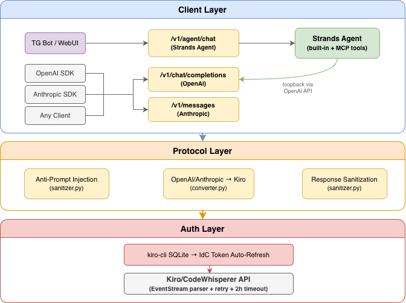

# kiro2chat

Wrap Kiro CLI's Claude backend into an OpenAI + Anthropic compatible API Gateway, with Strands Agent integration for tool calling.

> ⚠️ **Note:** The Kiro backend injects an IDE system prompt with tool definitions (readFile, fsWrite, webSearch, etc.) that only work inside the Kiro IDE. kiro2chat implements a three-layer defense (anti-prompt injection + assistant confirmation + response sanitization) to counteract this.

## Features

- 🔄 **Dual Protocol API** — OpenAI `/v1/chat/completions` + Anthropic `/v1/messages`
- 🧹 **Prompt Sanitization** — Three-layer defense against Kiro IDE prompt injection
- 🛠️ **Strands Agent** — Built-in + MCP tools, loopback through the OpenAI-compatible API
- 🌐 **Web UI** — Gradio 6 multi-page interface (chat, monitoring, settings)
- 📱 **Telegram Bot** — Agent-powered bot with image I/O, Markdown rendering
- 🔑 **Auto Token Management** — Reads and auto-refreshes IdC tokens from kiro-cli SQLite
- 📊 **Token Estimation** — CJK-aware token counting (tiktoken + fallback)
- 📈 **Prometheus Metrics** — Request counts, latency, tokens, errors, retries

## Architecture



## Quick Start

```bash
# Prerequisites: kiro-cli installed and logged in
cd ~/repos/kiro2chat
uv sync
cp .env.example .env   # edit with your config

./kiro2chat.sh start   # start all services in background
./kiro2chat.sh stop    # stop
```

> Run `./kiro2chat.sh attach` to view live output (detach with `Ctrl+B D`).

Or run directly:

```bash
uv run kiro2chat all       # all services
uv run kiro2chat api       # API server only (port 8000)
uv run kiro2chat webui     # Web UI only (port 7860)
uv run kiro2chat bot       # Telegram Bot only
```

### Usage with OpenAI SDK

```python
from openai import OpenAI

client = OpenAI(base_url="http://localhost:8000/v1", api_key="not-needed")
response = client.chat.completions.create(
    model="claude-sonnet-4",  # Any model name works
    messages=[{"role": "user", "content": "Hello!"}],
)
print(response.choices[0].message.content)
```

### Usage with Anthropic SDK

```python
import anthropic

client = anthropic.Anthropic(base_url="http://localhost:8000", api_key="not-needed")
message = client.messages.create(
    model="claude-sonnet-4",
    max_tokens=1024,
    messages=[{"role": "user", "content": "Hello!"}],
)
print(message.content[0].text)
```

## API Endpoints

| Endpoint | Method | Description |
|----------|--------|-------------|
| `/v1/chat/completions` | POST | OpenAI-compatible chat (stream + non-stream) |
| `/v1/models` | GET | List available models |
| `/v1/messages` | POST | Anthropic Messages API (stream + non-stream) |
| `/v1/messages/count_tokens` | POST | Token count estimation |
| `/v1/agent/chat` | POST | Strands Agent chat (SSE stream) |
| `/v1/agent/tools` | GET | List loaded tools |
| `/v1/agent/reload` | POST | Reload MCP tools |
| `/health` | GET | Health check |
| `/metrics` | GET | Prometheus metrics |

## System Prompt Sanitization

Kiro's backend injects an IDE system prompt with tool definitions that don't exist outside the IDE. kiro2chat implements **three-layer defense**:

1. **Anti-Prompt Injection** — Prepends a high-priority override declaring Claude identity and denying all IDE tools while encouraging user-provided tools
2. **Assistant Confirmation** — Injects an assistant turn confirming it will ignore IDE tools but actively use user-provided tools
3. **Response Sanitization** — Regex-based post-processing strips leaked tool names, Kiro identity references, and XML markup

## Project Structure

```
kiro2chat/src/
├── __init__.py           # Version (__version__)
├── _tool_names.py        # Built-in tool name registry
├── app.py                # Entry point, FastAPI app, lifespan, CORS, CLI
├── config.py             # Config (env vars > config.toml > defaults)
├── config_manager.py     # TOML config read/write + Kiro MCP config
├── log_context.py        # ContextVar user tag + logging filter
├── stats.py              # Thread-safe request statistics
├── metrics.py            # Prometheus metrics
├── agent.py              # Strands Agent + MCP tool loading
├── webui/
│   ├── __init__.py       # create_ui(), LAUNCH_KWARGS, main()
│   ├── chat.py           # Chat page (multimodal, agent streaming)
│   ├── monitor.py        # Monitoring page (stats, logs)
│   └── settings.py       # Settings page (model config, MCP config)
├── core/
│   ├── __init__.py       # TokenManager (IdC token refresh)
│   ├── client.py         # Kiro API client (httpx async, retry logic)
│   ├── converter.py      # OpenAI ↔ Kiro protocol conversion
│   ├── eventstream.py    # AWS EventStream binary parser
│   ├── sanitizer.py      # Anti-prompt + response sanitization
│   ├── token_counter.py  # CJK-aware token estimator
│   └── health.py         # Health check utilities
├── api/
│   ├── routes.py         # /v1/chat/completions, /v1/models (OpenAI)
│   ├── anthropic_routes.py # /v1/messages (Anthropic)
│   └── agent_routes.py   # /v1/agent/chat, /v1/agent/tools, /v1/agent/reload
└── bot/
    └── telegram.py       # Telegram Bot (aiogram)
```

## Tech Stack

| Component | Technology |
|-----------|------------|
| Web Framework | FastAPI + Uvicorn (async) |
| HTTP Client | httpx (async, retry) |
| AI Agent | Strands Agents SDK |
| LLM Provider | strands OpenAIModel → kiro2chat API (loopback) |
| Web UI | Gradio 6 (multi-page Navbar) |
| Telegram Bot | aiogram 3 |
| Config | python-dotenv + TOML (tomllib/tomli-w) |
| Auth | kiro-cli SQLite → AWS IdC OIDC Token Refresh |
| Monitoring | Prometheus (prometheus-client) |
| Package Manager | uv + hatchling |
| Python | ≥ 3.13 |

## Configuration

### Environment Variables (`.env`)

Startup params and secrets, see `.env.example`:

| Variable | Default | Description |
|----------|---------|-------------|
| `TG_BOT_TOKEN` | *(none)* | Telegram Bot token |
| `API_KEY` | *(none)* | Optional API authentication key |
| `HOST` | `0.0.0.0` | Server bind address |
| `PORT` | `8000` | API server port |
| `LOG_LEVEL` | `info` | Log level (console handler) |
| `KIRO_DB_PATH` | `~/.local/share/kiro-cli/data.sqlite3` | kiro-cli database path |
| `IDC_REFRESH_URL` | *(AWS default)* | AWS IdC token refresh endpoint |
| `KIRO_API_ENDPOINT` | *(AWS default)* | Kiro/CodeWhisperer API endpoint |

### Model Config (`config.toml`)

Editable via Web UI or directly at `~/.config/kiro2chat/config.toml`:

| Key | Description |
|-----|-------------|
| `default_model` | Default model name |
| `model_map` | Model name mapping |

### Other

- **MCP tools**: `~/.kiro/settings/mcp.json` (reuses Kiro CLI config)

## Deployment

See [docs/DEPLOYMENT.md](docs/DEPLOYMENT.md) for systemd, nginx, and monitoring setup.

## Changelog

See [CHANGELOG.md](CHANGELOG.md)

## License

MIT
