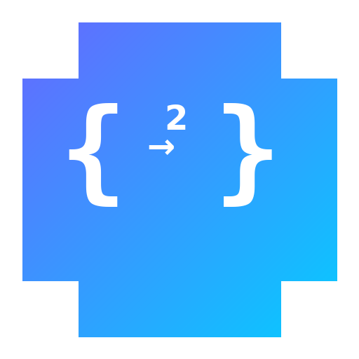

<div align="center">
  
  <h1>kiro2chat</h1>
  <p><strong>Kiro → 标准 API 网关</strong></p>
  <p>将 Kiro CLI 的 Claude Opus 4.6 后端封装为完全兼容的 OpenAI + Anthropic API 网关</p>

  **[English](README.md)** | **[中文](README_CN.md)**

  
  
  
  
</div>

---

## ✨ 功能特性

- 🔄 **双协议兼容** — 同时支持 OpenAI `/v1/chat/completions` 和 Anthropic `/v1/messages` 格式
- 🧠 **Claude Opus 4.6 1M** — 后端固定使用最强模型，1M 上下文窗口
- 🧹 **系统提示词清洗** — 三层防御彻底清除 Kiro IDE 注入的系统提示词和工具定义
- 🛠️ **完整 Tool Calling** — 支持工具定义、tool_choice、tool_result 多轮回传、MCP 工具
- 📡 **流式 + 非流式** — 两种 API 格式均支持 SSE 流式和同步响应
- 🔑 **自动 Token 管理** — 从 kiro-cli SQLite 读取并自动刷新 IdC Token
- 📊 **Token 用量估算** — CJK 感知的字符级 token 估算
- 🤖 **Strands Agent** — 可选的 Agent 层，支持 MCP 工具
- 🌐 **Web UI** — Gradio 多页面界面（聊天、监控、配置）
- 📱 **Telegram Bot** — 通过 Agent 层的 TG 机器人

## 🏗️ 架构

```
┌─────────────────────────────────────────────────────────────┐
│                        客户端层                              │
│                                                              │
│  OpenAI SDK ──┐                                              │
│  Anthropic SDK┤──→ /v1/chat/completions (OpenAI 格式)        │
│  Claude Code ─┤──→ /v1/messages         (Anthropic 格式)     │
│  任意客户端  ─┘                                              │
│                           │                                  │
├───────────────────────────┼──────────────────────────────────┤
│                   协议转换层                                  │
│                           │                                  │
│    ┌──────────────────────┼──────────────────────┐           │
│    │  反提示词注入 (sanitizer.py)                  │           │
│    │  → 清除 Kiro IDE 系统提示词                   │           │
│    │  → 阻止 IDE 工具泄露                         │           │
│    │  → 强制 Claude 身份                          │           │
│    └──────────────────────┼──────────────────────┘           │
│                           │                                  │
│    OpenAI/Anthropic → CodeWhisperer (converter.py)           │
│    EventStream 二进制 → JSON (eventstream.py)                │
│    响应 → 清洗后输出 (sanitizer.py)                           │
│                           │                                  │
├───────────────────────────┼──────────────────────────────────┤
│                    认证层                                     │
│    kiro-cli SQLite → IdC Token 自动刷新                      │
│    (~/.local/share/kiro-cli/data.sqlite3)                    │
│                           │                                  │
│                           ↓                                  │
│    CodeWhisperer API (claude-opus-4.6-1m)                    │
└─────────────────────────────────────────────────────────────┘
```

## 📋 API 端点

| 端点 | 方法 | 格式 | 说明 |
|------|------|------|------|
| `/v1/chat/completions` | POST | OpenAI | 聊天补全（流式 + 非流式） |
| `/v1/models` | GET | OpenAI | 列出可用模型 |
| `/v1/messages` | POST | Anthropic | Messages API（流式 + 非流式） |
| `/v1/messages/count_tokens` | POST | Anthropic | Token 计数估算 |
| `/v1/messages/batches` | POST | Anthropic | 批处理 API（存根，501） |
| `/v1/agent/chat` | POST | 自定义 | Strands Agent 聊天 |
| `/v1/agent/tools` | GET | 自定义 | 列出已加载工具 |
| `/health` | GET | — | 健康检查 |
| `/` | GET | — | 服务信息 |

## 🚀 快速开始

### 前置条件

```bash
# 1. 安装 kiro-cli 并登录
kiro-cli login

# 2. 克隆并安装
git clone https://github.com/neosun100/kiro2chat.git
cd kiro2chat
uv sync
```

### 运行

```bash
# 仅 API 服务（端口 8000）
uv run kiro2chat api

# Web UI（端口 7860）
uv run kiro2chat webui

# Telegram Bot
uv run kiro2chat bot

# 全部一起启动
uv run kiro2chat all
```

### 使用 OpenAI SDK

```python
from openai import OpenAI

client = OpenAI(base_url="http://localhost:8000/v1", api_key="not-needed")

response = client.chat.completions.create(
    model="claude-opus-4.6-1m",  # 任何模型名都可以
    messages=[{"role": "user", "content": "你好！"}],
)
print(response.choices[0].message.content)
```

### 使用 Anthropic SDK

```python
import anthropic

client = anthropic.Anthropic(base_url="http://localhost:8000", api_key="not-needed")

message = client.messages.create(
    model="claude-opus-4.6-1m",
    max_tokens=1024,
    messages=[{"role": "user", "content": "你好！"}],
)
print(message.content[0].text)
```

### 使用 curl

```bash
# OpenAI 格式
curl http://localhost:8000/v1/chat/completions \
  -H "Content-Type: application/json" \
  -d '{"model": "gpt-4o", "messages": [{"role": "user", "content": "你好"}]}'

# Anthropic 格式
curl http://localhost:8000/v1/messages \
  -H "Content-Type: application/json" \
  -d '{"model": "claude-opus-4.6-1m", "max_tokens": 1024, "messages": [{"role": "user", "content": "你好"}]}'
```

## 🔧 API 兼容性

### OpenAI `/v1/chat/completions`

| 功能 | 状态 |
|------|------|
| 文本生成（流式 + 非流式） | ✅ |
| System / Developer 角色消息 | ✅ |
| 多轮对话 | ✅ |
| 工具定义 + tool_calls | ✅ |
| Tool result 多轮回传 | ✅ |
| tool_choice (none/auto/required) | ✅ |
| temperature / top_p / stop | ✅ |
| presence_penalty / frequency_penalty | ✅ |
| stream_options (include_usage) | ✅ |
| 任意模型名接受 | ✅ |
| 增量流式 tool_calls | ✅ |
| MCP 工具调用 | ✅ |
| Token 用量估算 | ✅ |

### Anthropic `/v1/messages`

| 功能 | 状态 |
|------|------|
| 文本生成（流式 + 非流式） | ✅ |
| System prompt（字符串 + content blocks） | ✅ |
| 多轮对话 | ✅ |
| 工具定义（Anthropic 格式） | ✅ |
| tool_result 多轮回传 | ✅ |
| tool_choice (auto/any/tool/none) | ✅ |
| 图片 blocks (base64 + URL) | ✅ |
| Thinking blocks（透传） | ✅ |
| stop_sequences | ✅ |
| SSE 事件 (message_start/delta/stop) | ✅ |
| input_json_delta 流式 | ✅ |
| count_tokens 端点 | ✅ |
| Token 用量估算 | ✅ |

## 🧹 系统提示词清洗

Kiro 的 CodeWhisperer 后端会注入 IDE 系统提示词，包含工具定义（readFile、fsWrite、webSearch 等），这些工具在 IDE 外部不存在。kiro2chat 实现了**三层防御**：

1. **反提示词注入** — 在每个请求前注入高优先级覆盖指令，声明真实身份（Claude by Anthropic）并明确否认所有 IDE 工具
2. **助手确认** — 注入一个假的助手回复，确认将忽略 IDE 工具但积极使用用户提供的工具
3. **响应清洗** — 基于正则的后处理，清除输出中泄露的工具名、Kiro 身份引用和 XML 标记

**结果**：28/28 对抗性测试场景通过，零泄露。

## ⚙️ 配置

### 环境变量

| 变量 | 默认值 | 说明 |
|------|--------|------|
| `HOST` | `0.0.0.0` | 服务绑定地址 |
| `PORT` | `8000` | API 服务端口 |
| `KIRO_DB_PATH` | `~/.local/share/kiro-cli/data.sqlite3` | kiro-cli 数据库路径 |
| `API_KEY` | *(无)* | 可选的 API 认证密钥 |
| `TG_BOT_TOKEN` | *(无)* | Telegram Bot token |
| `LOG_LEVEL` | `info` | 日志级别 |

### 模型映射

接受所有模型名。后端始终使用 `claude-opus-4.6-1m`。常见别名：

| 客户端发送 | 后端使用 |
|---|---|
| `gpt-4o`, `gpt-4`, `gpt-3.5-turbo` | `claude-opus-4.6-1m` |
| `claude-opus-4.6-1m`, `claude-opus-4.6` | `claude-opus-4.6-1m` |
| `claude-sonnet-4.5`, `claude-sonnet-4` | `claude-opus-4.6-1m` |
| 任意其他字符串 | `claude-opus-4.6-1m` |

## 🚢 部署

### Systemd 服务

```bash
# 安装服务
sudo cp kiro2chat@.service /etc/systemd/system/
sudo systemctl daemon-reload
sudo systemctl enable --now kiro2chat@$(whoami)

# 查看状态
sudo systemctl status kiro2chat@$(whoami)
journalctl -u kiro2chat@$(whoami) -f
```

### 环境变量方式启动

```bash
nohup env API_KEY="your-key" PORT="8800" HOST="0.0.0.0" \
  uv run kiro2chat api > /tmp/kiro2chat.log 2>&1 &
```

## 📁 项目结构

```
kiro2chat/src/
├── __init__.py              # 版本号 (__version__ = "0.6.0")
├── app.py                   # FastAPI 应用、生命周期、CLI、CORS、异常处理
├── config.py                # 配置（环境变量 > TOML > 默认值）
├── config_manager.py        # TOML 配置读写 + MCP 配置
├── stats.py                 # 线程安全的请求统计
├── webui.py                 # Gradio 多页面 Web UI
├── agent.py                 # Strands Agent + MCP 工具
├── _tool_names.py           # 内置工具名注册表
├── core/
│   ├── __init__.py          # TokenManager（IdC token 刷新）
│   ├── client.py            # CodeWhisperer API 客户端（httpx 异步）
│   ├── converter.py         # OpenAI ↔ CodeWhisperer 协议转换
│   ├── eventstream.py       # AWS EventStream 二进制解析器
│   ├── sanitizer.py         # 反提示词 + 响应清洗 + 身份擦除
│   ├── health.py            # 健康检查工具
│   └── token_counter.py     # CJK 感知的 token 估算器
├── api/
│   ├── routes.py            # /v1/chat/completions, /v1/models (OpenAI)
│   ├── anthropic_routes.py  # /v1/messages, /v1/messages/count_tokens (Anthropic)
│   └── agent_routes.py      # /v1/agent/* (Strands Agent)
└── bot/
    └── telegram.py          # Telegram Bot (aiogram)
```

## 📝 更新日志

### v0.8.0 — 精确 Token 计数 & Nginx 优化 (2026-02-26)

#### 📊 精确 Token 计数
- 用 **tiktoken cl100k_base** 编码替代字符估算
- 中文文本精度从 ±48% 误差提升到**精确匹配**
- 所有 token 计数现在与 OpenAI tokenizer 完全一致
- tiktoken 不可用时优雅降级到字符估算

#### 🔧 Nginx 优化
- `proxy_read_timeout` / `proxy_send_timeout`：300s → **7200s**（支持长输出 2 小时）
- `proxy_http_version`：添加 **1.1**（SSE 流式必需）
- `proxy_connect_timeout`：添加 **60s**
- `chunked_transfer_encoding`：**on**，`proxy_cache`：**off**

### v0.7.0 — 图片支持 & 生产部署 (2026-02-26)

#### 🖼️ 图片支持
- OpenAI `image_url`（data URI base64）→ CW `images` 格式转换
- Anthropic `image` blocks（base64 + URL）→ CW `images` 格式转换
- 已测试：像素颜色识别通过公网端点端到端验证

#### 🔧 生产部署
- **systemd 服务** — `Restart=always`，3 秒延迟，开机自启
- 替代 nohup/supervisor.sh，使用正规进程管理
- `journalctl -u kiro2chat -f` 统一日志查看

### v0.6.0 — MCP 工具调用 & 流式修复 (2026-02-26)

**重大更新：通过客户端 SDK 完整支持 MCP 工具调用**

#### 🔧 MCP 工具调用
- **`toolUseEvent` 流式支持** — CodeWhisperer 以增量 `toolUseEvent` 块返回工具调用（name → input 片段 → stop），现在正确聚合为完整的 `tool_calls`
- **Tool result 回传修复** — 客户端 MCP 工具（firecrawl 等）现在可以搜索/抓取并返回结果，正确转发到后端
- **History 构建修复** — 带 `toolUses` 的 assistant 消息现在在 tool result 回传时正确放入 CW history（之前导致 400 错误）
- **JSON content block 解析** — 客户端工具结果以 `[{"type":"text","text":"..."}]` 字符串发送时，现在正确展平为纯文本
- **工具结果截断** — 超长工具结果（>50K 字符）自动截断

#### 🧹 反提示词重新平衡
- 重写反提示词，**鼓励使用用户提供的工具**，同时继续阻止 Kiro IDE 工具
- 之前版本过于激进——压制了合法的 MCP 工具调用（firecrawl、web search 等）
- 现在明确区分：IDE 工具（阻止）vs 用户 API 工具（积极使用）

#### 📝 流式 Markdown 修复
- 修复 `sanitize_text()` 去除流式块首尾空白的问题
- 之前破坏 Markdown 渲染：`---\n\n## 标题` 变成 `---## 标题`
- 流式块现在保留原始空白；仅完整响应做 trim

#### 📊 Token 用量估算
- 新增 `token_counter.py`，CJK 感知的字符级估算
- OpenAI：`prompt_tokens`、`completion_tokens`、`total_tokens`（流式和非流式）
- Anthropic：`input_tokens`、`output_tokens`（`message_start` 和 `message_delta` 事件）
- `count_tokens` 端点使用相同估算器

### v0.5.0 — API 网关 (2026-02-26)

**重大升级：完整的 OpenAI + Anthropic API 兼容性**

- 双协议支持（OpenAI + Anthropic）
- 后端固定 Claude Opus 4.6 1M
- 三层系统提示词清洗（28/28 测试通过）
- 完整参数透传、tool_choice、工具验证
- CORS、全局异常处理、健康检查
- systemd 服务模板

### v0.4.0 — Agent 集成

- Strands Agent 集成 + MCP 工具
- Agent API 端点 + TG Bot

### v0.3.0 — 工具调用

- OpenAI 兼容 tool_calls 支持

### v0.2.0 — Web UI

- Gradio 多页面 Web UI + 监控面板

### v0.1.0 — 初始版本

- OpenAI 兼容 API + kiro-cli token 自动刷新

## 👥 贡献者

<table>
  <tr>
    <td align="center">
      <a href="https://github.com/aleck">
        <br/>
        <sub><b>Aleck</b></sub>
      </a><br/>
      <sub>原作者</sub>
    </td>
    <td align="center">
      <a href="https://github.com/neosun100">
        <br/>
        <sub><b>Neo</b></sub>
      </a><br/>
      <sub>API 网关 & 清洗系统</sub>
    </td>
  </tr>
</table>

**[Aleck](https://github.com/aleck)** 设计了核心架构——CodeWhisperer 协议逆向工程、EventStream 二进制解析器和 kiro-cli Token 管理。

**[Neo](https://github.com/neosun100)** 在此基础上将项目扩展为生产级 API 网关：
- 完整的 OpenAI + Anthropic 双协议兼容
- 三层系统提示词清洗（28/28 对抗性测试通过）
- MCP 工具调用，支持 `toolUseEvent` 流式聚合
- 图片支持（OpenAI `image_url` + Anthropic `image` blocks）
- 基于 tiktoken 的精确 token 计数
- Nginx 长连接 SSE 流式优化
- systemd 生产部署
- 双语文档（中文/英文）

我们欢迎社区贡献！无论是 Bug 修复、新功能、文档改进还是测试用例——所有贡献都受到感谢。

## 📄 许可证

MIT
